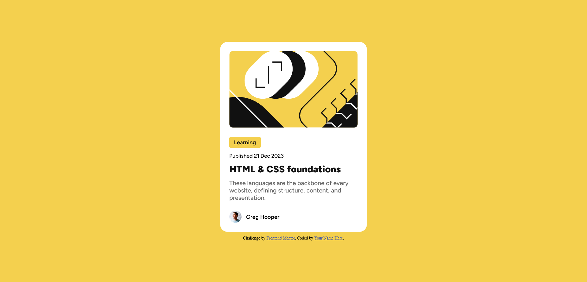

# Frontend Mentor - Blog preview card solution

This is a solution to the [Blog preview card challenge on Frontend Mentor](https://www.frontendmentor.io/challenges/blog-preview-card-ckPaj01IcS). Frontend Mentor challenges help you improve your coding skills by building realistic projects.

## Table of contents

  - [The challenge](#the-challenge)
  - [Screenshot](#screenshot)
  - [Links](#links)
  - [Built with](#built-with)
  - [What I learned](#what-i-learned)
  - [Continued development](#continued-development)
- [Author](#author)

### The challenge

Users should be able to:

- See hover and focus states for all interactive elements on the page

### Screenshot

### Links

- Solution URL: [Add solution URL here]([https://your-solution-url.com](https://www.frontendmentor.io/solutions/blog-card-preview-OFAhOETmEC))
- Live Site URL: [Add live site URL here](https://frontend-mentor-cardpreview-alexcdnl.netlify.app/)

### Built with

- Semantic HTML5 markup
- CSS custom properties
- Flexbox
- SASS

### What I learned

Better use of scss, better responsive design, hover.

### Continued development

Better optimization, better responsive !

## Author

- Frontend Mentor - [@yourusername](https://www.frontendmentor.io/profile/Alex-CDNL)

